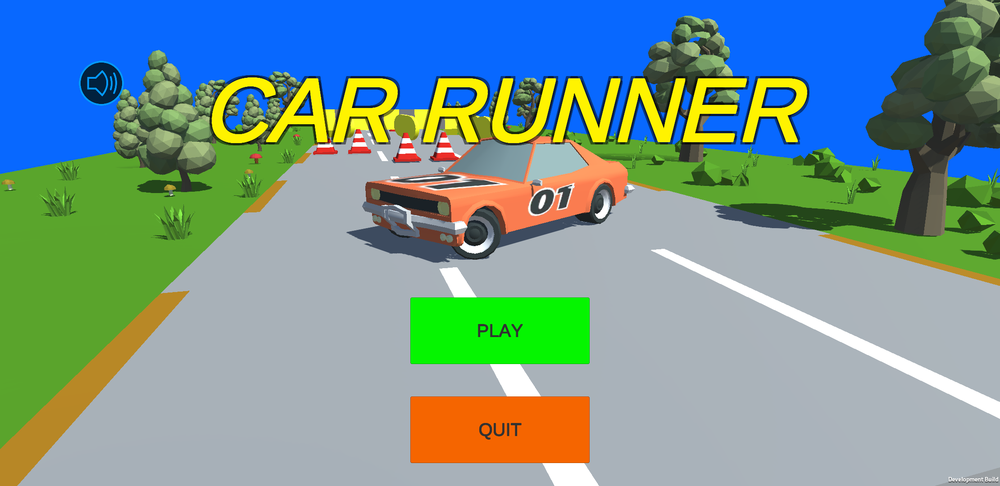
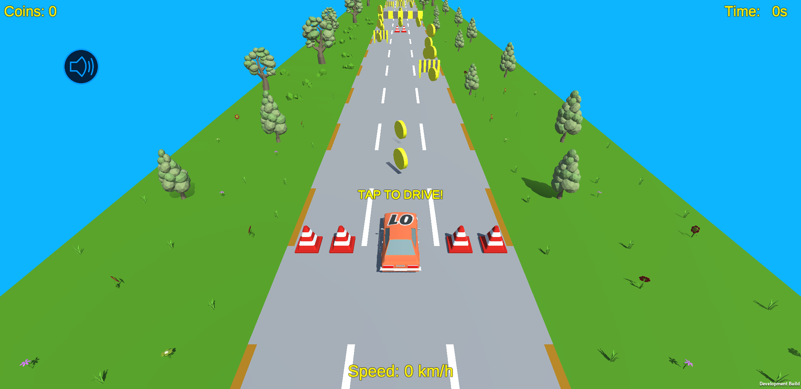
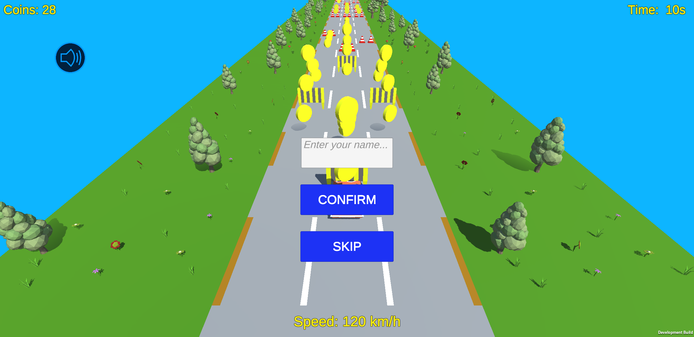
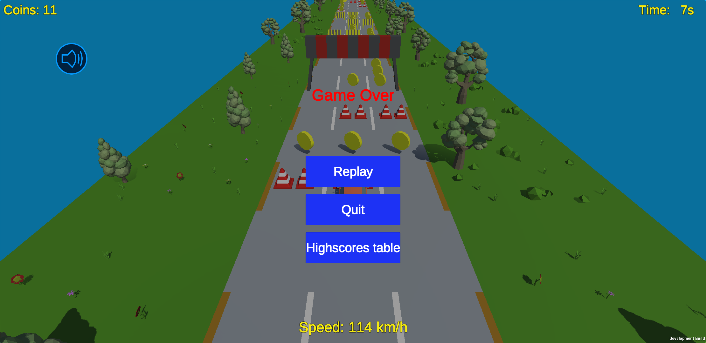
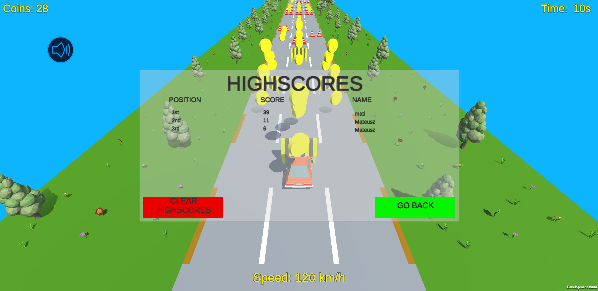

# Car Runner - mobile game     

Car Runner is an Android 3D mobile game made using Unity game engine. 

Player's goal is to travel the maximum distance and collect as many coins as possible,\
avoiding all of obstacles on the road. 

  

## About

Car Runner is a game in endless-runner style. While steering a car, among generated on the road obstacles you will see road blocks, traffic cones and road works barriers of various heights and sizes and of course the most important in game - coins. Your gameplay will be located in landscape with trees, mushrooms and green grass with marvelous blue sky. Such a wonderfull scenery!

After crash you will have possibility to save your score with your name in highscores table as well as browse highscores table with TOP 10 scores.

## Screenshots:

1. Home screen with sound turned on:

2. Home screen with muted sound:

3. Start of the game:

4. Entering your name or skipping adding score to highscores table after crash:

5. Game over screen:

6. Highscores table:

## Gameplay

 

## Installation 

You can install Car-runner on device running Android OS version 4.4 KitKat minimum, using provided application package in \*.apk format file, by clicking this link to download latest release [**v.1.2.0**](https://github.com/mwalasz/Endless-runner/releases/download/v1.2.0/CarRunner_1_2_0.apk) or entering [**Releases**](https://github.com/mwalasz/Endless-runner/releases) section in our repository to choose your version.

## Technologies
* Unity 2019.3.12f1
* C# 7.3
